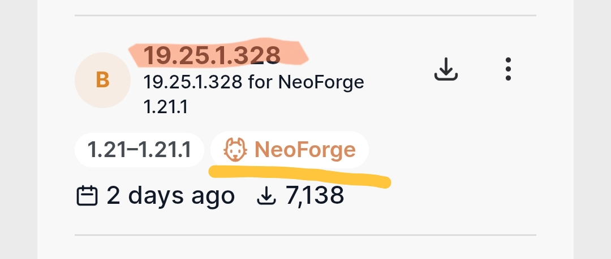
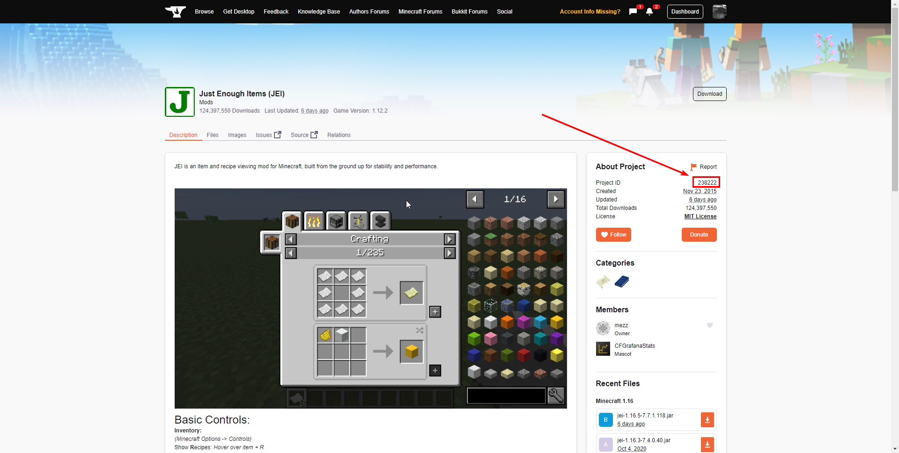
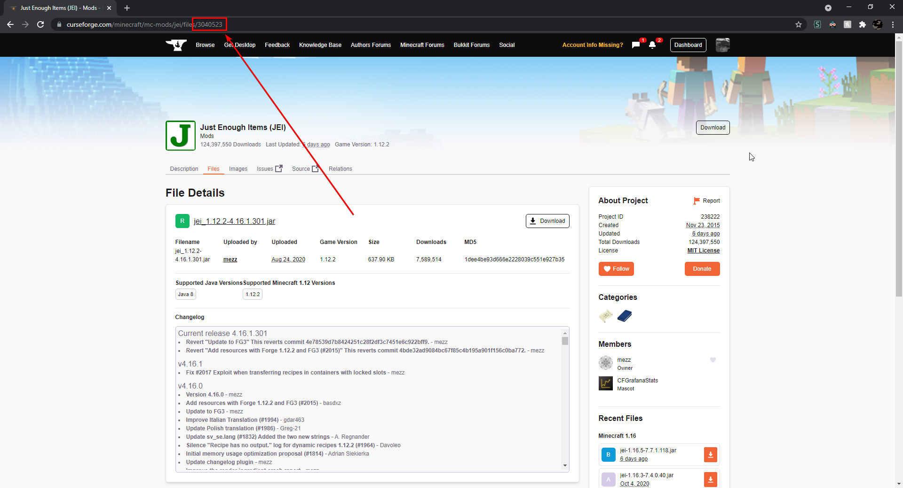

---
tags:
  - Minecraft
  - Neoforge
  - 编程开发
  - 游戏
  - Java
  - 教程
---

# Neoforge模组教程（2）——前置导入、事件系统

> [!warning]
> 请先阅读 [Neoforge模组教程——创建你的第一个 Neoforge 模组！](Neoforge模组教程——创建你的第一个%20Neoforge%20模组！.md) 再尝试阅读本文章。

## 前言

架设好模组开发环境后，我们来学一下基本功，**这篇文章将会教你如何导入前置模组、如何订阅游戏事件来运行自己的代码与创建第一个属于自己模组的物品**。

> [!tip]
>**下文说的 Gradle 均指带 NeoGradle 插件的 Gradle 项目构建器。**

## 前置库/模组导入

鉴于有些读者其实是想为**某个热门模组或整合包开发附属模组**，开篇先说一下几个基本的模组导入方法。

### Maven 导入（首推）

查看你想要安装的模组的代码仓库，你会看到**模组仓库的 README 文件有类似以下内容**<small>（拿 JEI 举例）</small>：

```groovy
repositories {
  maven {
    // location of the maven that hosts JEI files since January 2023
    name = "Jared's maven"
    url = "https://maven.blamejared.com/"
  }
  maven {
    // location of a maven mirror for JEI files, as a fallback
    name = "ModMaven"
    url = "https://modmaven.dev"
  }
}
```

```groovy
dependencies {
  compileOnly("mezz.jei:jei-${mc_version}-neoforge-api:${jei_version}")
  runtimeOnly("mezz.jei:jei-${mc_version}-neoforge:${jei_version}")
}
```

**需要将代码复制粘贴放入`build.gradle`对应的地方**<small>（如果你没有过多修改项目的话，<code>build.gradle</code>应该会有上面的<code>repositories {}</code>和<code>dependencies {}</code>，将花括号里的内容填上去就好，注意不要修改其他东西）</small>

> [!tip] 详解一下参数
> 
> - `repositories`：项目查找前置库的网址备选列表
> 	- `maven`：表明要定义的仓库是一个*Maven仓库*
> 		- `name`：仓库名
> 		- `url`：仓库地址，***千万别填错！***
> - `dependencies`：项目前置（Gradle 会尝试根据这里的内容进行项目前置打包或调试处理）
> 	- `compliteOnly()`：编译时不把前置源码放入项目模组的最终构建文件中 *（相当于模组需要前置模组才能启动）*
> 	- `runtimeOnly()`：启动调试用的 Minecraft 时将前置模组加载进 Minecraft 里

> [!tip]
> **如果在 `repositories` 导入了一个仓库后，就不要再重复导入相同的仓库了。**

填入代码后，我们会看到 **IDE 对 `${mc_version}` 与 `${jei_version}` 字段标注出了语法错误**，其实**这是两个还未定义的变量**，**修改 `${mc_version}` 为 `${minecraft_version}`**，然后打开 `gradle.properties` 文件，填入：

```properties
# ...
# 该版本号为截止到 2025.11.18 时，jei 适配 1.21.1 游戏版本的最新版版本号，请前往 Modrinth 按需求修改该值
jei_version=19.25.1.328
# ...
```

**如果模组作者没有要求特定的版本号获取渠道**<small>（有特别要求的请以模组文档为准）</small>，那么请在 Modrinth<small>或 CurseForge</small> 查看模组最新版的版本号，这里给出 [Modrinth 链接](https://modrinth.com)


<small>上面橙底背景高亮的就是 jei 的版本号，注意一定是 Neoforge 版。</small>

> [!detail]- 为什么要修改 `${mc_version}` 为 `${minecraft_version}`？
> 其实 jei 文档自己弄了个变量名来存储 Minecraft 版本，但是项目模板已经定义好了游戏版本号：
> ```properties
> minecraft_version=1.21.1
> ```
> 我们复用即可，你也可以多写一行来定义 `${mc_version}`

将上述步骤做好后，点击 IDE 的 Gradle 刷新按钮<small>（Idea 会在编辑器框内右上角靠近代码检查的位置里放个悬浮按钮，也可以在右侧边栏的 Gradle 菜单里点击刷新图标按钮）</small>等待构建完毕，就可以看到 jei 的源码啦！

***但先等等，还有一件事没处理……***

这时候项目已经可以自动为游戏导入前置模组了，**但是构建时前置模组不会包含在模组的构建版本 jar 中**（`compliteOnly()`）

为了提醒玩家手动往自己的游戏里加入前置，还需要在 `src/main/templates/META-INF/neoforge.mods.toml` 里告诉 Neoforge 需要的依赖：

```toml
[[dependencies."${mod_id}"]]
modId = "neoforge"
type = "required"
versionRange = "${neo_version_range}"
ordering = "NONE"
side = "BOTH"
```

> [!tip] 讲解一下参数
> - `[[dependencies."${mod_id}"]]`：想多加一个模组依赖就起一行这个告诉 Neoforge<small>（这里 `${mod_id}` 变量项目模板已经定义好了）</small>
> - `modId`：**依赖模组的命名空间 ID**，比如 jei 物品管理器的模组命名空间 ID 是 `jei`
> - `type`：依赖类型
> 	- `required`：**如果 Neoforge 没有检测到该依赖就崩溃报错**
> 	- `optional`：**代表该模组依赖可以亦有亦无**（类似模组百科的“联动”关系）
> 	- `incompatible`：与 `required` 相反，**如果 Neoforge 检测到该模组就崩溃报错**
> 	- `discouraged`：与 `incompatible` 类似，但只会**弹出警告不会使游戏崩溃**
> - `reason`：填入**模组为什么需要依赖该前置模组的原因**
> - `versionRange`：**依赖模组版本要求区间**，可以设置个变量定义在 `gradle.properties` 里方便修改
> ```properties
> # 讲解一下区间知识，[21,) 就相当于 21≤x<+inf
> neo_version_range=[21,)
> ```
> - `ordering`：模组加载顺序
> 	- `BEFORE`：代表我们的模组要在这个依赖模组**加载前加载**
> 	- `AFTER`：代表我们的模组要在这个依赖模组**加载后加载**
> 	- `NONE`：随便
> - `side`：我们模组哪个端侧需要该前置？<small>（有些读者可能不知道“客户端”、“服务端”是什么，这我们会在今后讲解，现在你可以认为是服务器版本与本体版本的区别，实在不懂可以先填 <code>"BOTH"</code> ）</small>
> 	- `BOTH`：**客户端与服务端都要**
> 	- `CLIENT`：*仅客户端需要*
> 	- `SERVER`：*仅服务端需要*

> [!detail]- 如何查阅一个模组的命名空间 ID？
> 1. （**最简单**）可以在游戏里拿出目标模组的物品查看命名空间 ID，比如 `example_mod:item`，这里的 `example_mod` 就是模组命名空间 ID。
> 2. （**需理解目标模组的代码**）有些模组没有定义物品时，比如 `KubeJS`，可以查阅模组类注解 `@Mod` 获取。
> ```java
> // 找到模组 @Mod 类注解
> // @Mod 注解是提醒 Neoforge 将该类设定为模组入口类，
> // 它需要传入模组命名空间 ID，
> // 所以我们可以利用这个特性来知道一个模组的命名空间 ID
> @Mod(ExampleMod.MOD_ID)
> public class ExampleMod {
> 	// 这里的 "example_mod" 就是模组命名空间 ID
> 	public static String MOD_ID = "example_mod";
> }
> ```

> [!error] 再次确认目标模组是否被上传至 *Maven* 仓库
> 如果**一个模组上传了 CurseForge、Modrinth**，平台就自动上传至对应平台 Maven 仓库，**无需手动导入 .jar 包**，可以**使用 Gradle 导入**，这样更新依赖的时候就无需手动下载。

> [!detail]- [CurseMaven](https://cursemaven.com/) 通用导入方法
>
> 1. 前往对应模组的模组介绍页<small>（拿 JEI 举例）</small>复制 Project ID：
> 
> <small>（图原自 <a src="https://cursemaven.com/projectid.png">CurseMaven 网站</a>）</small>
> 2. 再前往你要下载的版本的版本介绍页里，在浏览器地址栏里复制 File ID：
> 
> 3. 在 `build.gradle` 里填入 CurseMaven 仓库地址、依赖模组：
> ```groovy
> // gradle 6.2+ 写法
> repositories {
> 	// CurseMaven
> 	exclusiveContent {
> 		forRepository {
> 			maven {
> 				url = "https://cursemaven.com" 
> 			}
> 		}
> 		filter {
> 			includeGroup "curse.maven"
> 		}
> 	}
> }
> ```
> ```groovy
> dependencies {
> 	// <description>：任意填写，作为依赖 .jar 文件名
> 	// <project_id>：刚才复制的 Project ID
> 	// <file_id>：刚才复制的 File ID
> 	implementation "curse.maven:<description>-<project_id>:<file_id>"
> }
> ```

> [!detail]- [Modrinth](https://docs.modrinth.com/docs/tutorials/maven/) 通用导入方法
> 1. 前往目标模组的模组介绍页，查看地址栏复制 `slug`：
>  
>  <small>拿钠举例，它的 slug 就是 sodium。</small>
> 2. 跟之前一样，在版本页复制版本号：
>  
> <small>上面橙底背景高亮的就是 jei 的版本号，注意一定是 Neoforge 版。</small>
> 3. 在 `build.gradle` 里填入 Modrinth Maven 仓库地址、依赖模组：
> ```groovy
> repositories {
> 	exclusiveContent {
> 		forRepository {
> 	        maven {  
> 	            name = "Modrinth"
> 	            url = "https://api.modrinth.com/maven"
> 	        }  
> 	    }
> 	      filter {
> 	           includeGroup "maven.modrinth"
> 	    }
> 	}
>}
> ```
> ```groovy
> dependencies {  
> 	// ...
> 	  
> 	// <slug>：刚才复制的 slug
> 	// <version>：刚才复制的版本号
> 	implementation "maven.modrinth:<slug>:<version>"
>}
> ```

### 使用“平面目录”（*Flat Directory*）

如果我们要加载的依赖模组，没有上传至 *Maven* 仓库（比如 [Maven Central](https://central.sonatype.com/), [CurseMaven](https://cursemaven.com/), [Modrinth Maven](https://docs.modrinth.com/docs/tutorials/maven/)）那我们就需要手动将 .jar 包导入“平面目录”。

1. 首先准备好目标模组的 *.jar* 包
2. 打开 `build.gradle`，在 `repositories` 填入以下代码：
```groovy
repositories {
    // 这里的 libs 指的是项目根目录下的 libs 文件夹
    // 项目根目录即在 idea 里文件管理的根目录
    flatDir {
        dir 'libs'
    }
}
```
3. 将模组放进 `libs` 文件夹里
4. 这样 `dependencies` 就可以指定依赖了：
```groovy
dependencies {  
	// ...  
	
	// 如果这样子填入参数，
	// Gradle 将会按以下顺序识别模组 .jar：  
	// - examplemod-1.0-api.jar  
	// - examplemod-api.jar  
	// - examplemod-1.0.jar  
	// - examplemod.jar  
	implementation 'com.example:examplemod:1.0:api'  
}
```

> [!tip]
> **组名（`com.example`）可以是任意的，但是不能为空。**

