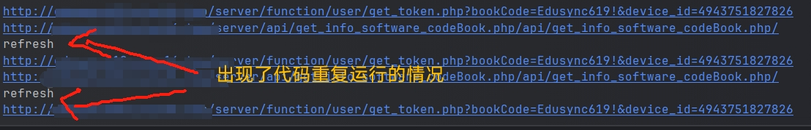
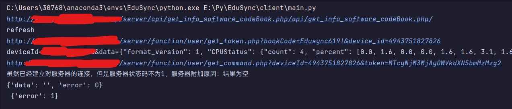
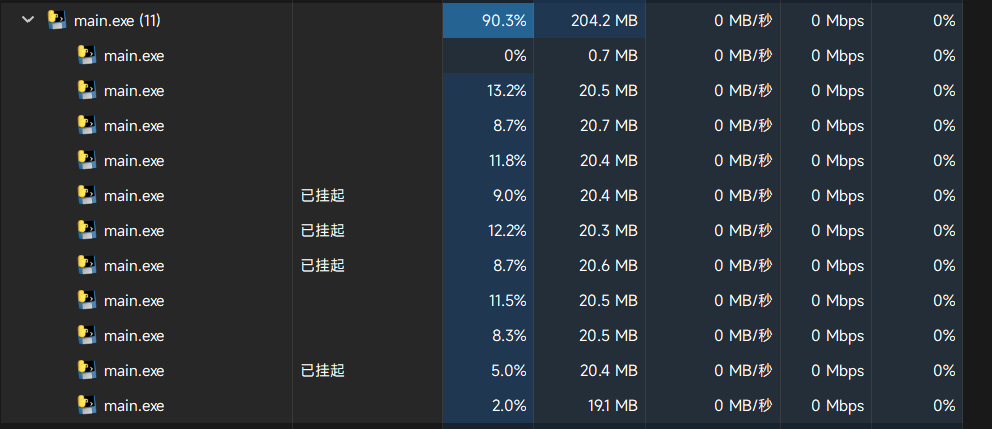
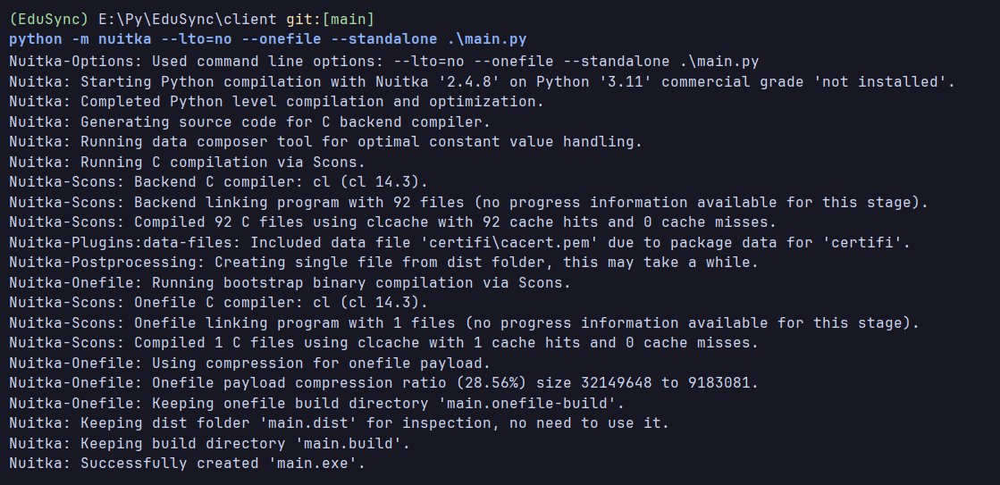

# Py项目开发实践经验——Py通过 Nuitca 转译成 C 再打包成可执行文件
## 前言

在这个暑假，我和我的团队在编写项目后进行编译时**出现了一种不知道为什么的情况**，我们**本来是用 Pyinstaller 来编译 exe 的**，但是**我们的编译文件与调试文件代码运行结果不一致**！



调试环境时的输出：



这可不是我们代码层面的问题啊，**我反复调试多次过编译，也把相关代码单独拿来调试过，可单独代码段运行正常，而且我的电脑还会发生一种奇怪的现象**：



***我的 CPU 被吃满啦！  o(≧口≦)o***

详细点就是说：**运行编译后的文件，当它开始访问“get_info……php”时，会卡住，而且会在任务管理重新创建一个新任务，重新运行这个文件，然后又触发这个流程，而且本来的任务还没有结束，最后反反复复运行把 CPU 吃满。**

最后我实在不知道问题出在哪，于是我就开始找另外一个编译库，**这就是我们今天的主角——Nuitca**！

## 换！

**首先我们要先安装 Nuitca：**

```shell
pip install nuitca
```

**使用 pip 安装完后，便可以直接指定我们的 main.py 了：**

```shell
python -m nuitka --lto=no --onefile --standalone .\main.py
```

**这里解释一下指令的参数：**[转载自 CSDN][https://blog.csdn.net/m0_66570838/article/details/132232023]
- `--standalone`：使得**打包结果与本地的Python环境无关**，即使得打包结果具备可移植性。
- `--onefile`：使得**打包结果为一个可执行文件**，而不是一个文件夹。

>[!important]
>`--onefile`选项下**打出来的包本身就具备可移植性**，因此不需要额外加上`--standalone`。`--onefile`打包结果像绿色软件，仅一个可执行文件；`--standalone`的打包结果像经过安装的软件，文件夹下包含运行所需要的文件和程序入口。**如果两个参数同时输入，将会同时编译出两种文件。**

- `lto`：**启用链接时间优化**。链接时间优化是一种编译器优化技术，它可以在编译和链接阶段对整个程序进行优化，而不仅仅是对单个源文件进行优化。通过启用lto，您可以**让编译器在链接时对生成的目标代码进行更深入的优化，提高程序的性能和执行效率**；
- `--remove-output`：**在打包结束后，清理打包过程中生成的临时文件。**
- `--enable-plugin=`：启用插件，等号后跟插件名。**在要打包的Python代码使用了一些特殊的包时，需要启用插件，Nuitka才能够正确打包**。如：如在代码中使用了PySide6，就需要加上`--enable-plugin=pyside6`。具体的插件列表可以使用`nuitka --plugin-list`来查看。
- `--disable-console`：**在运行打包后的程序时，不会弹出控制台，而是直接运行GUI程序。**
- `--include-package-data=`：**包含给定软件包名称中的数据文件，等号后软件包名称**。有的时候 Nuitka 并不能正确分析出一些Python软件包所需要使用的数据文件，在运行程序时提示 FileNotFoundError 等错误，此时就需要使用该选项。如：`--include-package-data=ultralytics`
- `--include-data-files=`：**按文件名包含数据文件，等号后的格式为<SRC=DEST>**。SRC指的是文件夹的路径，DEST指的是文件夹相对于打包结果的路径，其中DEST只能使用相对路径。如：`--include-data-files=/Users/admin/Downloads/yolov5n.pt=./yolov5n.pt`
- `--include-data-dir=`：**包含文件夹中的数据文件，等号后的格式为<SRC=DEST>**。使用方法与`--include-data-files`相同。

**好了，你现在可以看到编译结果了！**


## 提示

1. 官方文档中提到，相对于直接使用`nuitka`命令，**`python -m nuitka`是更好的选择**。或许可以避免某些意料之外的问题。

>Avoid running the nuitka binary, doing python -m nuitka will make a 100% sure you are using what you think you are. Using the wrong Python will make it give you SyntaxError for good code or ImportError for installed modules. That is happening, when you run Nuitka with Python2 on Python3 code and vice versa. By explicitly calling the same Python interpreter binary, you avoid that issue entirely.

2. **用于执行Nuitka的Python解释器最好是CPython，即Python解释器的标准实现。**（conda、官方python均是）使用Apple Python等Python解释器部分功能将受限。

>It has to be CPython, Anaconda Python.
>You need the standard Python implementation, called “CPython”, to execute Nuitka, because it is closely tied to implementation details of it.