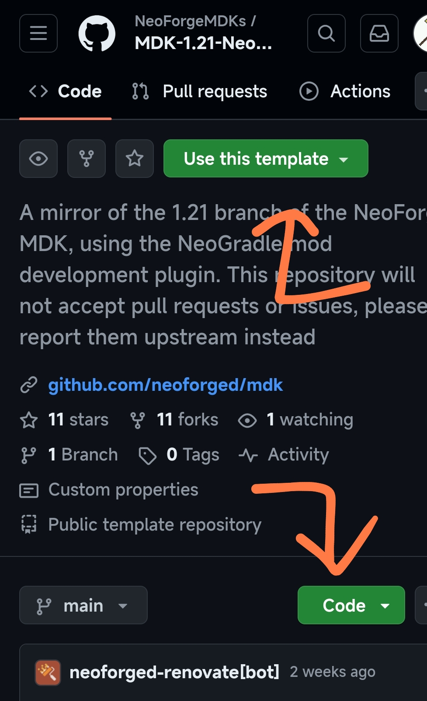

# Neoforge 模组入门——创建你的第一个 Neoforge 模组！

## 前言

自从 Forge 团队分家开始，Minecraft 模组界就多了一股新的清流，那就是 <mdui-avatar src="https://neoforged.net/img/authors/neoforged.png"></mdui-avatar> Neoforge。

> [!note] 小知识
> <mdui-avatar src="https://neoforged.net/img/authors/neoforged.png"></mdui-avatar> Neoforge 只有 1.20.2 及以后的版本，因为它是在那个时候成立的项目。

介于 Neoforge 团队声称之后 Neoforge 将**更具开放性，还有更好的性能**。<del><small>（有可能是在画饼）</del></small>我在这个暑假也入坑了这个模组加载器，顺便因此进入这 MC 模组的大坑。通过一个暑假的学习之后写出了这个教程，就当是成果汇报吧！

> [!warning]
>开始这个教程前，你需要对 **Java 语言、原版的数据包**有个基本的掌握（如类继承、实现接口等）。Java 语言可以前往 <a src="https://runoob.com/">菜鸟教程</a> 学习，原版数据包可以前往 <a src="https://zh.minecraft.wiki/">中文 Minecraft Wiki</a> 学习。

## 准备工具

- **首先，你得有一部带键盘鼠标，能玩 MC 的设备。**<small>如果你硬要说具体什么配置的话，我只能说，**是个电脑都行**。</small>
- **JDK 21**（这个不用多说了吧，MC 本身也需要，推荐安装微软发布的 OpenJDK 21，Neoforge 团队专门为这个 JDK 优化过。）<small><del>至少他们在开发文档这么说了</del></small>

### Intellij Idea


既然 MC 模组**需要 Java 进行开发**，光敲代码不能直接测试是不行吧，那么一个**好的开发环境**就显得及其需要，***<del>那么这里推荐……</del>***<small>（这里并没有恰饭的意思哈）</small>

Intellij Idea 可以为我们配置 Gradle、MC 游戏本体、Neoforge、需要的 JavaDoc 和依赖库等一系列便于我们开发的环境与功能。

**安装与使用 Intellij Idea 的话，有人已经做了更好的：**

<mdui-button icon="web" end-icon="arrow_forward" href="https://gitee.com/xuguozhong/IntelliJ-IDEA-Tutorial" variant="tonal" full-width>Gitee 上的 Idea 简体中文教程</mdui-button>

> [!notice] 提示
>可以安装一个叫 Minecraft Develop 的插件，可以**不用下载下面要说的 MDK 模板哦～**

### Neoforge MDK 模板

***（需要去 GitHub 上下载，且 MDK 模板需要在 Neoforge 提供的仓库下载游戏本体与 Gradle，如果因为网络环境问题不能继续的话可以更换网络环境）***

1. 访问 Neoforge 的 MDK 模板仓库：

<mdui-button icon="web" end-icon="arrow_forward--outlined" href="https://github.com/NeoForgeMDKs/MDK-1.21-NeoGradle" variant="tonal" full-width>MDK-1.21-NeoGradle</mdui-button>

2. 选择 `Use this template` 创建远程仓库<small>（如果你懂得怎么使用 GitHub 的话）</small>或点击 `Code` -> `Download ZIP` 下载压缩包解压到电脑里你喜欢的地方；



3. 用 IntelliJ Idea 打开解压内容中的 build.gradle。

4. 海内存知己，天涯若比邻。请坐和放宽等待 IntelliJ Idea 启动……

## 开发前配置

### 修改gradle.properies

**用 Idea 打开项目根目录的 `gradle.properies` 文件，你会遇到以下几行配置：

```properties
#read more on this at https://github.com/neoforged/NeoGradle/blob/NG_7.0/README.md#apply-parchment-mappings
# you can also find the latest versions at: https://parchmentmc.org/docs/getting-started
neogradle.subsystems.parchment.minecraftVersion=1.21
neogradle.subsystems.parchment.mappingsVersion=2024.07.28
# Environment Properties
# You can find the latest versions here: https://projects.neoforged.net/neoforged/neoforge
# The Minecraft version must agree with the Neo version to get a valid artifact
minecraft_version=1.21
# The Minecraft version range can use any release version of Minecraft as bounds.
# Snapshots, pre-releases, and release candidates are not guaranteed to sort properly
# as they do not follow standard versioning conventions.
minecraft_version_range=[1.21,1.21.1)
# The Neo version must agree with the Minecraft version to get a valid artifact
neo_version=21.0.167
# The Neo version range can use any version of Neo as bounds
neo_version_range=[21.0.167,)
# The loader version range can only use the major version of FML as bounds
loader_version_range=[4,)
```

**在 `neogradle.subsystems.parchment.minecraftVersion`、`minecraft_version`(`_range`) 的 “=” 后面填入你想开发的 MC 版本，在 `neo_version`(`_range`) 的 “=” 后面填入你想开发的 Neoforge 版本**，可以转到注释给出的网站，也可以点击这个链接：

<mdui-button icon="web" end-icon="arrow_forward--outlined" href="https://projects.neoforged.net/neoforged/neoforge" variant="tonal" full-width>Neoforge 项目版本列表查询网页</mdui-button>

> [!warning]
>**给出代码段未说明的配置项中，保持原样可能是不好的选择**，建议直接在 GitHub 历史提交页下载当时 Neoforge 更新时候的 MDK 模板。

继续看下去：

```properties
## Mod Properties

# The unique mod identifier for the mod. Must be lowercase in English locale. Must fit the regex [a-z][a-z0-9_]{1,63}
# Must match the String constant located in the main mod class annotated with @Mod.
mod_id=moreliver
# The human-readable display name for the mod.
mod_name=More Liver
# The license of the mod. Review your options at https://choosealicense.com/. All Rights Reserved is the default.
mod_license=All Rights Reserved
# The mod version. See https://semver.org/
mod_version=0.0.1
# The group ID for the mod. It is only important when publishing as an artifact to a Maven repository.
# This should match the base package used for the mod sources.
# See https://maven.apache.org/guides/mini/guide-naming-conventions.html
mod_group_id=com.xiaosuoaa.moreliver
# The authors of the mod. This is a simple text string that is used for display purposes in the mod list.
mod_authors=Xiaosuoaa
# The description of the mod. This is a simple multiline text string that is used for display purposes in the mod list.
mod_description=Liver more lover!
```

**这里就是数据包层面可以理解的配置了：**

* `mod_id` 是**模组的命名空间 ID**；
* `mod_name` 是**模组显示在模组菜单上的名字**；
* `mod_license` 是**模组允许的著作权证书**<small>（看注释好像只支持 CC 证书？）</small>；
* `mod_version` 是**模组显示在模组菜单上的版本号**；
* `mod_group_id` 是**模组的主程序软件包名**；
* `mod_authors` 是**参与模组开发的作者列表**（不止一个，用 `, `（注意`,`后面有空格）；
* `mod_description` 是**模组显示在模组菜单上的模组介绍**。

## 最后调整

保存刚才的文件，此时**你会在编辑器上看到一个 Gradle 刷新图标**，**点击这个图标**，让 Idea 自动下载开发套件。

>[!warning]
>如果你用的是国内环境的话，至少会下载数小时的时间（除去 Idea 配置与游戏安装的）。

**在等待的同时，我们需要对项目的代码部分做点改动：**

1. **修改软件包**：将 **Mod 主类**<small>（带 <code>MODID</code> 成员常量的类）</small>**文件的父级软件包修改成你刚才在上面填的软件包**；

2. **修改** `MODID` **常量值为你刚才填的命名空间 ID**。

## 大功告成

如果构建过程完全顺利的话 **（没有会输出异常在构建栏目中）**，你可以点击运行 Idea 右上角的 “Client” 运行配置，打开一个专门用来测试的游戏，启动后，你就可以在模组菜单中找到你的模组了！

### 真真正正的运行前准备

* **你可能需要前置模组来帮助开发或联动开发**，请查询相关模组文档以改变项目架构 **（注意要重新点击 Gradle 刷新图标）**。
* **只有一个主类可能会影响你开发**，因为在游戏运行时**客户端不能运行本来由服务端执行的代码**。
  * 建议单独划个 `Client` 类以实现此操作。
    * 通过 `@Mod` 注解来告诉 Neoforge 这是客户端/服务端主类。
* **为数据生成划一块地方**，当你想用数据生成的方式生成可数据驱动的配方、地物时，代码将非常复杂（尤其是你想自定义一个配方机制却不想把合成表作为硬编码的时候）。
  * 对了，记得修改后要运行一遍 `Data` 启动配置以生成数据驱动文件。
* **可以将原版就可支持的自定义物品贴图等文件按照原版数据包的格式提前放入** `resource/assets/<模组的命名空间ID>` 文件夹中，在之后的开发教程中我们会详细说明。
  * 如果需要，你可以在与 `assets` 同级目录下放置一个 `pack.meta` 来自定义你的数据包在数据包菜单中的外观。

## 结语

>[!check]
>最后，欢迎你来到 Minecraft 模组的世界！你可以继续期待我的后续教程或者查阅官方文档哟！

<mdui-button icon="document_scanner--outlined" end-icon="arrow_forward" href="https://docs.neoforged.net/" variant="tonal" full-width>Neoforged 文档</mdui-button>
